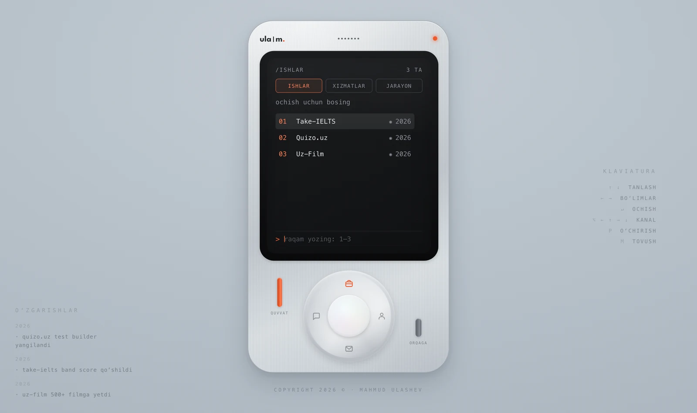
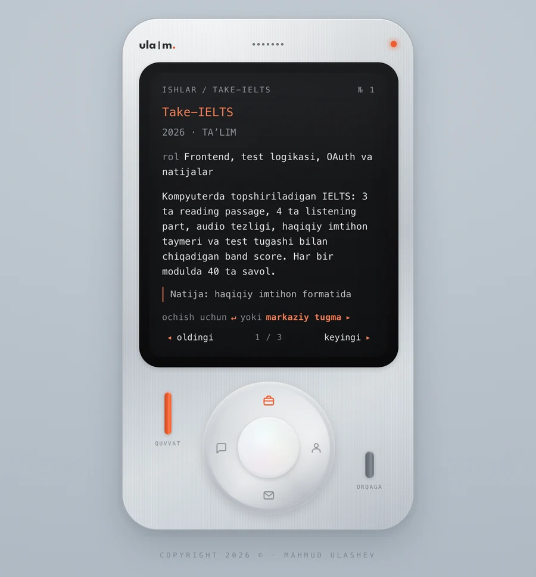
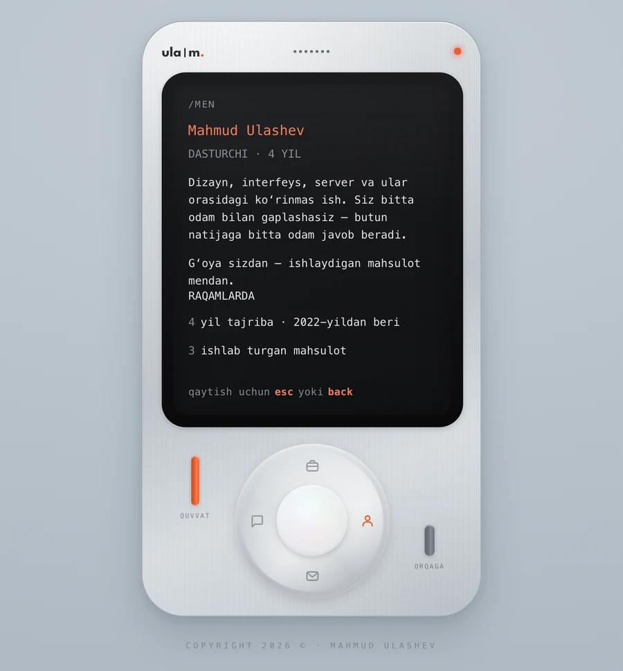
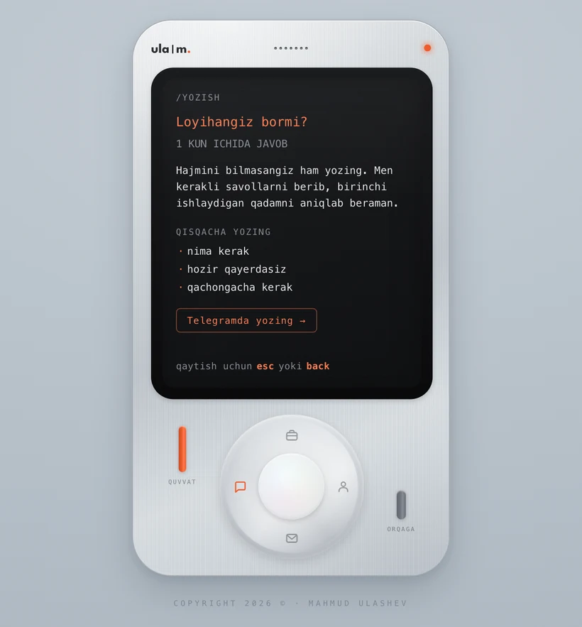

# ula|m. — Portfolio as a Handheld Console

A personal portfolio built as a fictional handheld device: you switch it on, turn the
channel wheel, and read through the work on a CRT screen. No framework, no build step,
no dependencies — three files and the platform.

**Live:** [www.ulashev.uz](https://www.ulashev.uz) · **O'zbekcha README:** [README.uz.md](README.uz.md)



---

## Why it is built this way

A portfolio is a claim about how you build things, so the site itself is the argument.
Everything here is hand-written: the enclosure, the CRT, the click of the buttons and the
sound they make. Nothing is pulled from a component library, and there is nothing to
install before it runs.

The constraint was deliberate — **zero dependencies, zero build tooling**. What that costs
in convenience it pays back in load time and in the absence of a toolchain to maintain.

## What is in here

| | |
|---|---|
| **Stack** | HTML, CSS, vanilla JavaScript (ES2020) |
| **Dependencies** | none — no npm, no bundler, no framework |
| **Build step** | none — the source *is* the deploy artifact |
| **Files** | `index.html`, `styles.css`, `app.js` |
| **Hosting** | Vercel, static |

## Features

**The device.** The whole enclosure is CSS: ribbed shell, bezel, screen sheen, scanlines,
vignette and a moving spotlight. On a pointer device it tilts toward the cursor with a
spring that parks its own `requestAnimationFrame` loop once it settles, so an idle page
costs nothing.

**Sound, synthesized.** Every click, tick and power chime is generated at runtime with the
Web Audio API — oscillators, an envelope and a noise buffer. There is not a single audio
file in the repository. The audio context opens on first interaction, because browsers
block it before that.

**Three ways to drive it.** Keyboard (arrows, `↵`, `Esc`, `P` for power, `M` for sound,
`⌥`+arrow to jump channels), pointer (the wheel is a real rotary control — drag it and it
counts quarter turns), and touch. The interface adapts its own instructions to the input
it detects, so a phone is never told to press a key it does not have.

**Readable without the device.** All content exists twice: once in the `DATA` and `PAGES`
objects that the screen renders, and once as ordinary semantic HTML in a visually hidden
block. Screen readers and crawlers get headings, paragraphs and links — not an inert
canvas.

**Details.** JSON-LD structured data, Open Graph and Twitter cards, sitemap, PWA manifest,
`prefers-reduced-motion` honoured throughout, and `localStorage` access wrapped so private
mode cannot throw.

| Project detail | About | Contact form |
|---|---|---|
|  |  |  |

## Running it

Any static file server will do — there is nothing to compile.

```bash
python3 -m http.server 4173
```

Then open `http://localhost:4173`.

## Editing the content

All copy lives at the top of [`app.js`](app.js) in two objects, deliberately kept apart
from the interaction code:

- `DATA` — the three channels of the menu (`work`, `services`, `process`) and their items
- `PAGES` — the standalone pages (`about`, `write`, `contact`)

Adding a project means adding one object to `DATA.work.items`. Nothing else needs to
change: counts, pagination, the numbered list and the keyboard prompt all read from it.

When you change the copy, mirror it in the hidden block in [`index.html`](index.html) so
the accessible version stays in step.

## Credits

The 3D tilt is ported from the sv-animations Tilt Card (MIT) — tilt limit, hover scale,
`perspective: 1200`, cursor spotlight.

## License

[MIT](LICENSE) for the code. The written content, the projects described and the `ula|m.`
mark are not covered — please do not republish the portfolio as your own.

---

**Mahmud Ulashev** — developer and product designer, Uzbekistan
[ulashev.uz](https://www.ulashev.uz) · [Telegram](https://t.me/mahmud_ulashev) · [GitHub](https://github.com/mahmudulashev)
