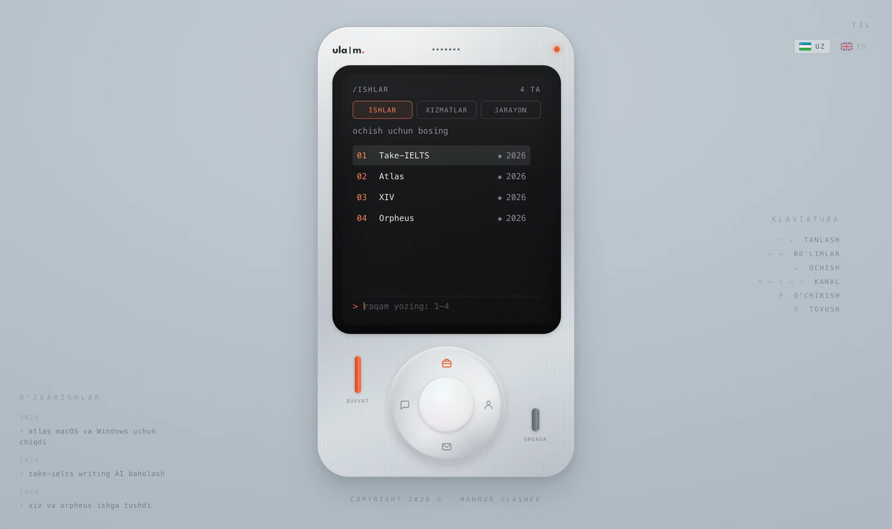
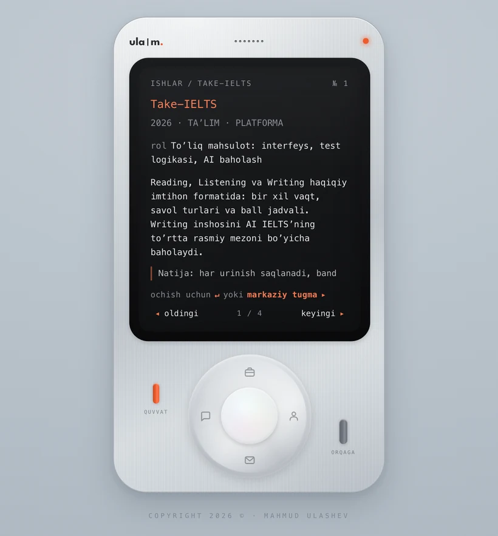
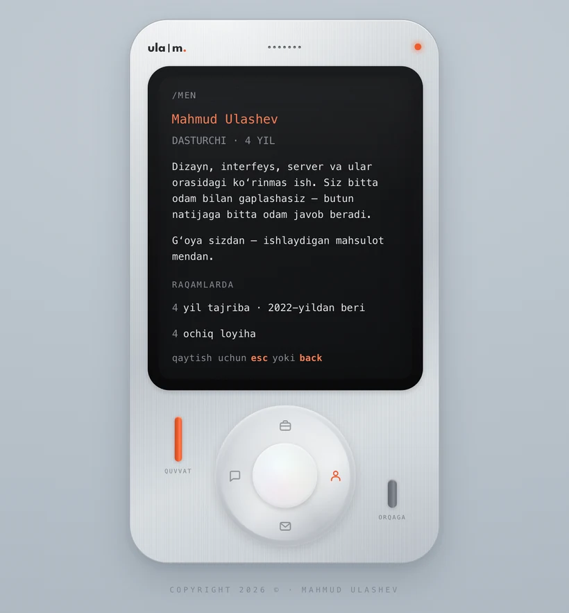
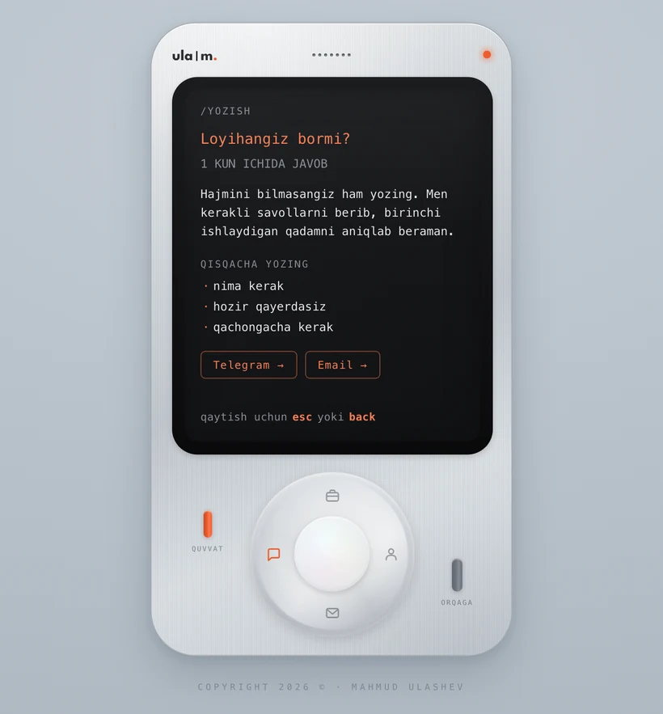

# ula|m. — konsol ko'rinishidagi portfolio

Shaxsiy portfolio o'ylab topilgan qo'l qurilmasi sifatida qurilgan: uni yoqasiz,
g'ildirakni burab kanalni almashtirasiz va ishlarni CRT ekranda o'qiysiz. Framework yo'q,
build bosqichi yo'q, bog'liqlik yo'q — uchta fayl va brauzerning o'zi.

**Sayt:** [www.ulashev.uz](https://www.ulashev.uz) · **English README:** [README.md](README.md)



---

## Nega aynan shunday qurilgan

Portfolio — bu odamning qanday ishlashi haqidagi da'vo, shuning uchun saytning o'zi shu
da'voning isboti. Bu yerdagi hamma narsa qo'lda yozilgan: korpus, CRT ekran, tugmalarning
bosilishi va ular chiqaradigan tovush. Hech qaysi qismi tayyor komponent kutubxonasidan
olinmagan va ishga tushirish uchun hech narsa o'rnatish shart emas.

Cheklov ataylab qo'yilgan: **bog'liqliksiz, build'siz**. Bu qulaylikdan yutqazgan narsani
yuklanish tezligi bilan va qaraladigan toolchain yo'qligi bilan qaytaradi.

## Nimadan iborat

| | |
|---|---|
| **Stack** | HTML, CSS, sof JavaScript (ES2020) |
| **Bog'liqliklar** | yo'q — npm ham, bundler ham, framework ham |
| **Build bosqichi** | yo'q — kodning o'zi deploy qilinadi |
| **Fayllar** | `index.html`, `styles.css`, `app.js` |
| **Hosting** | Vercel, statik |

## Imkoniyatlar

**Qurilma.** Butun korpus — CSS: qirrali yuza, bezel, ekran yaltirashi, skanlayn chiziqlar,
vinyetka va kursor ortidan yuradigan yorug'lik dog'i. Sichqoncha bor qurilmada korpus
kursor tomon egiladi; prujina to'xtashi bilan `requestAnimationFrame` sikli o'zini
o'chiradi, shuning uchun bo'sh turgan sahifa resurs yemaydi.

**Tovush — sintez qilingan.** Har bir bosish, chiqillash va yoqish ohangi Web Audio API
bilan ish vaqtida hosil qilinadi: ostsillyator, envelope va shovqin buferi. Repozitoriyda
bitta ham audio fayl yo'q. Audio konteksti birinchi bosishda ochiladi, chunki brauzerlar
undan oldin tovushni bloklaydi.

**Boshqarishning uch usuli.** Klaviatura (strelkalar, `↵`, `Esc`, quvvat uchun `P`, tovush
uchun `M`, kanal almashtirish uchun `⌥`+strelka), sichqoncha (g'ildirak haqiqiy rotary
boshqaruv — uni burasangiz, chorak aylanishlarni sanaydi) va sensor. Interfeys o'zi
aniqlagan kirish usuliga qarab ko'rsatmasini o'zgartiradi — telefonda hech qachon yo'q
tugmani bosish taklif qilinmaydi.

**Qurilmasiz ham o'qiladi.** Kontent ikki marta mavjud: bir marta ekran chizadigan `DATA`
va `PAGES` obyektlarida, ikkinchi marta ko'zga ko'rinmaydigan blokda oddiy semantik HTML
sifatida. Skrin-riderlar va qidiruv robotlari sarlavha, xatboshi va havolalarni oladi.

**Ikki til, bitta sahifa.** O'zbekcha va inglizcha bitta `I18N` obyektida yonma-yon turadi:
matn, klaviatura ro'yxati, bo'lim nomlari, `<title>`, meta tavsif va yashirin ochiq blok.
Til almashganda ekrandagi narsa joyini yo'qotmay qayta chiziladi, tanlov esa eslab qolinadi.
Birinchi tashrifda til `navigator.languages` ro'yxatidan topiladi: ro'yxatning istalgan
joyida `uz` bo'lsa — o'zbekcha, aks holda inglizcha. Bir marta tugma bosilgach, tanlov
har doim aniqlashdan ustun turadi.
Tugma qurilmaning o'zida emas, sayt chekkasida: kompyuterda yuqori o'ngda, telefonda esa —
u yerda "chekka" degan narsa yo'q — yuqori qatordagi ixcham "pill"da.

**Tafsilotlar.** JSON-LD strukturali ma'lumot, Open Graph va Twitter kartalari, sitemap,
PWA manifest, hamma joyda `prefers-reduced-motion` hisobga olingan va `localStorage`
xavfsiz o'ralgan — maxfiy rejimda xato bermaydi.

| Loyiha tafsiloti | Men haqimda | Yozish |
|---|---|---|
|  |  |  |

## Ishga tushirish

Istalgan statik server yetarli — kompilyatsiya qiladigan narsa yo'q.

```bash
python3 -m http.server 4173
```

So'ng `http://localhost:4173` manzilini oching.

## Kontentni o'zgartirish

Barcha matn [`app.js`](app.js) faylining boshida, ataylab interaksiya kodidan ajratilgan
ikkita obyektda turadi:

- `I18N.uz` va `I18N.en` — saytdagi barcha matn, har til uchun bitta shox
- har birining ichida: `data` (`work`, `services`, `process` kanallari), `pages` (`about`,
  `write`, `contact`), `changelog`, `legends` va `ui` yozuvlari

Yangi loyiha qo'shish uchun `data.work.items` ichiga bitta obyekt qo'shiladi — **ikkala
tilda ham**. Boshqa hech narsani o'zgartirish shart emas: soni, sahifalash, raqamlangan
ro'yxat va klaviatura ko'rsatmasi — hammasi o'sha yerdan o'qiladi.

Matnni o'zgartirganda [`index.html`](index.html) ichidagi ikkita yashirin blokni
(`#sr-uz` va `#sr-en`) ham yangilang, shunda ochiq versiya bilan mos qoladi.

## Kredit

3D egilish effekti sv-animations Tilt Card (MIT) asosida ko'chirilgan — egilish chegarasi,
hover masshtabi, `perspective: 1200`, kursor yorug'ligi.

## Litsenziya

Kod uchun [MIT](LICENSE). Yozilgan matn, tavsiflangan loyihalar va `ula|m.` belgisi bunga
kirmaydi — iltimos, portfolioni o'zingiznikidek qayta nashr qilmang.

---

**Mahmud Ulashev** — dasturchi va mahsulot dizayneri, O'zbekiston
[ulashev.uz](https://www.ulashev.uz) · [Telegram](https://t.me/mahmud_ulashev) · [GitHub](https://github.com/mahmudulashev)
